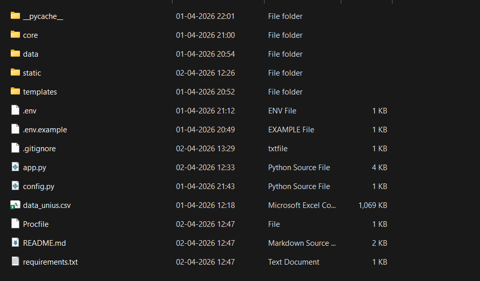
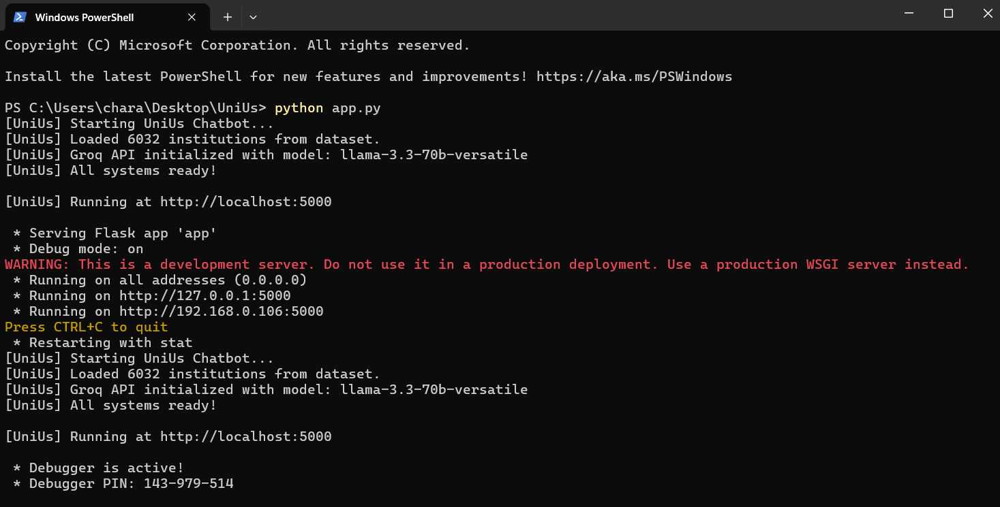
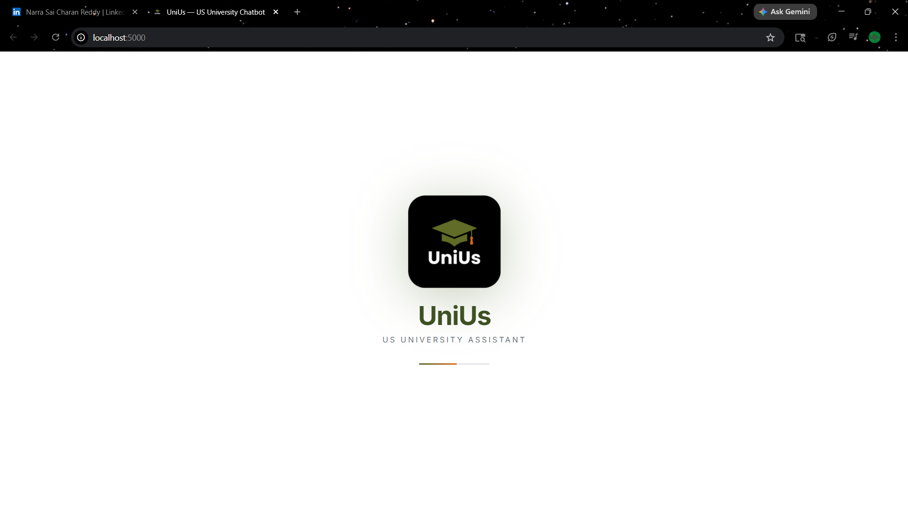
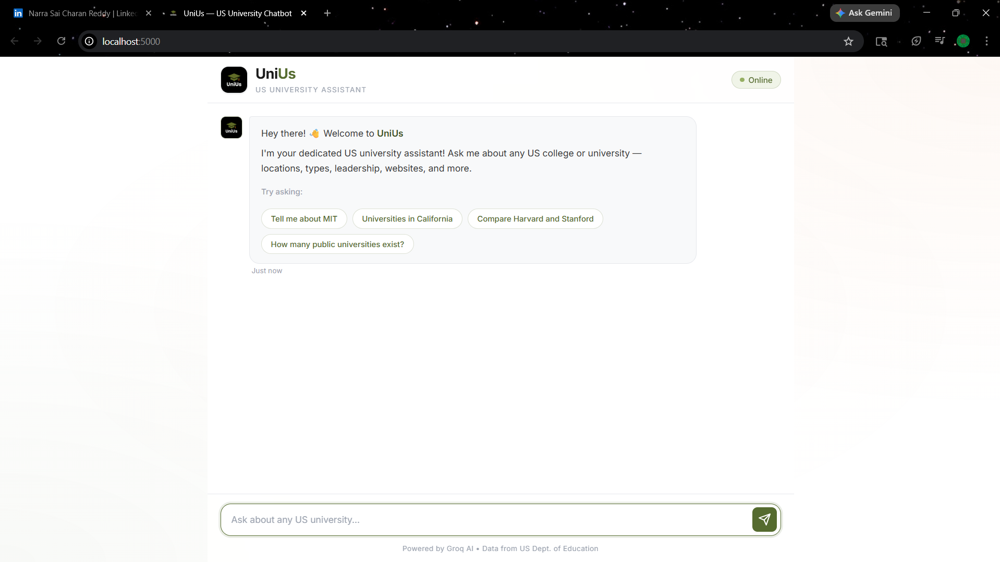

# UniUs 🎓

**UniUs** is a lightweight, AI-powered chatbot that provides information about US universities and colleges. Designed for efficiency, it combines local fuzzy-search data retrieval with Groq's blazing-fast LLM generation to answer questions about admissions, locations, rankings, and more.

## Features
*   **Specialized Focus:** Gated by a topic filter to ensure the bot *only* answers questions related to US higher education.
*   **Fuzzy Search Retrieval:** Uses RapidFuzz to find universities in a local dataset of over 6,000 institutions, even with typos or abbreviations (e.g., "MIT", "UCLA").
*   **Fast LLM Generation:** Powered by the Groq API (Llama 3) for near-instant natural language responses.
*   **Premium UI:** A clean, professional, mobile-responsive web interface featuring a modern light theme with olive green accents.

## Tech Stack
*   **Backend:** Python, Flask
*   **Frontend:** HTML5, Vanilla CSS, Vanilla JavaScript
*   **Data Processing:** Pandas, RapidFuzz
*   **AI/LLM:** Groq API

## 📸 Project Preview

### File Structure


### Running the Server


### Splash Screen


### Chatbot Interface


### Demo Video
https://github.com/NarraSaiCharanReddy2003/UniUs/blob/main/assets/unius-demo.mp4

---

## Local Development

### Prerequisites
*   Python 3.8+
*   A free API key from [Groq Console](https://console.groq.com)

### Installation

1. **Clone the repository**
   ```bash
   git clone https://github.com/NarraSaiCharanReddy2003/UniUs.git
   cd UniUs
   ```

2. **Install dependencies**
   ```bash
   pip install -r requirements.txt
   ```

3. **Configure the Environment**
   * Rename `.env.example` to `.env` (or create a new `.env` file).
   * Add your Groq API key:
     ```env
     GROQ_API_KEY=your_groq_api_key_here
     ```

4. **Run the Application**
   ```bash
   python app.py
   ```
   Open `http://localhost:5000` in your web browser.

## Deployment

This app is ready to be deployed on platforms like **Render**, **Railway**, or **Heroku**.
A `Procfile` is included for automatic deployment configurations.

Remember to set the `GROQ_API_KEY` in the environment variables of your hosting provider!